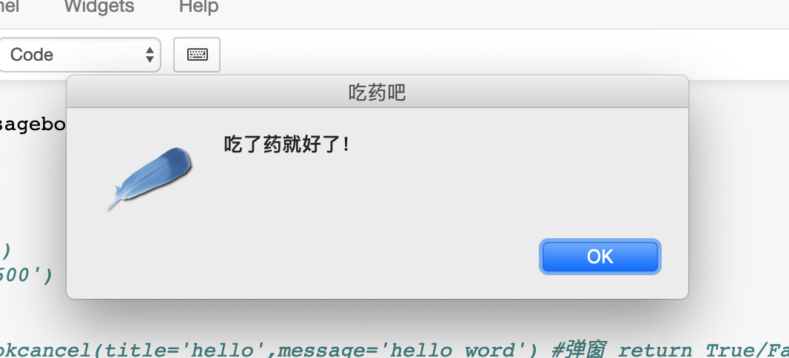

i在计算机系统里面定时是最重要的功能之一。在我们日常生活中定时，倒计时功能也是不可缺少的功能。 比如定时起身运动，定时喝水，定时扭脖子，定时吃饭，定时发邮件，定时提醒，etc。

今天我们给大家带来的是定时弹出消息框的功能。在定时弹出消息框的基础上相信大家可以扩展出无限的定时功能.

我们今天用到的UI库是python下Tk GUI的封装tkinter. python3 默认包含了tkinter，所以不需要额外安装python GUI包。
我们本例子中会每隔10秒钟提示一次吃药，总共提示3次。
定时器使用sched, 也不需要额外安装包。

~~~python
import tkinter as tk
from tkinter import messagebox        #引入弹窗库
import time  
import sched  # 定时器

window=tk.Tk()
# window.title('该吃药了')
# window.geometry('500x600')
 
def hit_me():
    #tc1=messagebox.askokcancel(title='hello',message='hello word') #弹窗 return True/False
    #print (tc1)
    #tc2=messagebox.askquestion(title='hello',message='hello word') #return yes/no
    #print (tc2)
    tc3=messagebox.showinfo(title='吃药吧',message='吃了药就好了！')  # return ok
    print (tc3)
# tk.Button(window,text='你打我呀!',command=hit_me).pack()
schedule = sched.scheduler ( time.time, time.sleep ) 
print(time.time())
schedule.enter(10,0,hit_me)  
schedule.enter(20,0,hit_me)  
schedule.enter(30,0,hit_me)  
schedule.enter(40,0,hit_me)  
schedule.run()  
print(time.time())
window.mainloop()
~~~

 你每隔10秒会看到下面这个对话框,提醒你该吃药了！
 
 
 
